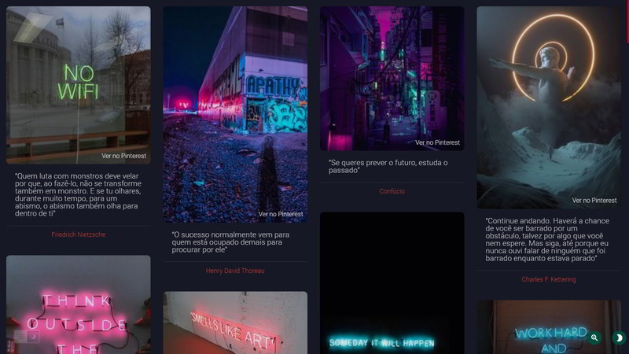

## Inspiration

<code>Click Here to Read English Explanation</code>

A striking project where design and inspiration come together in cultural images and 100 selected phrases in portuguese-BR

### Idea

The project was born from a moment of inspiration in development, which i wanted to share in a known format to me and that could be accessed by anyone with a link.

### Technologies

A library that i developed called [Minimalista](https://github.com/GuiDevloper/minimalista) is helping in DOM manipulation and (AJAX)[https://en.wikipedia.org/wiki/Ajax_(programming)] asynchronous loading.
[Webpack](https://webpack.js.org/) is being used to optimize final _builds_.
[SCSS](http://sass-lang.com/documentation/file.SCSS_FOR_SASS_USERS.html) a preprocessor of CSS is being used to improve the design write and focus in _browsers_ compatibility.

### Image Sources
All original images sources are found in [my Pinterest](https://pinterest.com/GuiDevloper) profile
\
\
Developed expressing my art of code with :heart:

Um projeto marcante onde design e inspiração se unem em imagens culturais e 100 frases selecionadas em português-BR

### Ideia

O projeto nasceu de um momento de inspiração no desenvolvimento, qual eu desejei compartilhar em um formato que eu me identifico e que poderia ser acessado por qualquer pessoa, com um link.

### Tecnologias

Uma biblioteca que desenvolvi chamada [Minimalista](https://github.com/GuiDevloper/minimalista) está ajudando na manipulação do DOM e carregamento assincrono via (AJAX)[https://pt.wikipedia.org/wiki/AJAX_(programa%C3%A7%C3%A3o)].
O [Webpack](https://webpack.js.org/) está sendo usado para otimizar as _builds_ finais
[SCSS](http://sass-lang.com/documentation/file.SCSS_FOR_SASS_USERS.html) um pré-processador de CSS está sendo usado para melhorar a escrita do design e focar na compatibilidade de _browsers_.

### Image Sources

As imagens originais são encontradas em meu [Pinterest](https://pinterest.com/GuiDevloper)
\
\
Desenvolvido expressando minha arte de codar com :heart:
